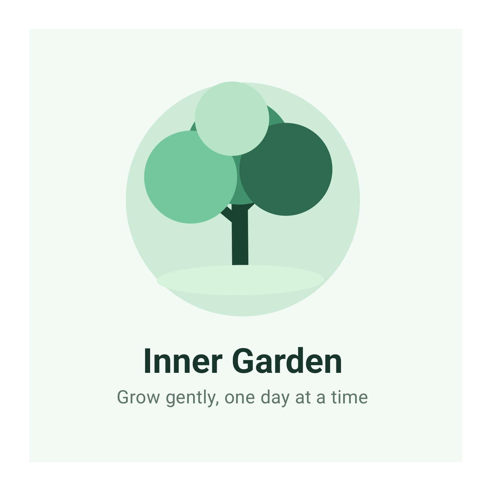
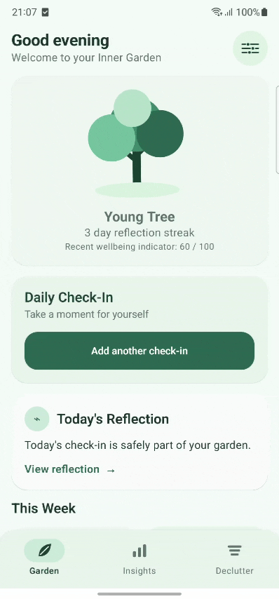
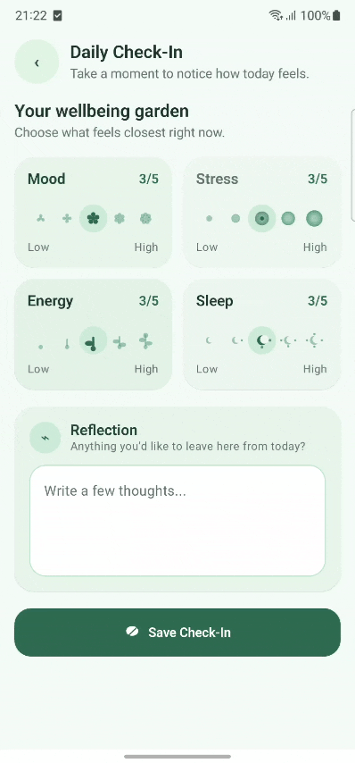
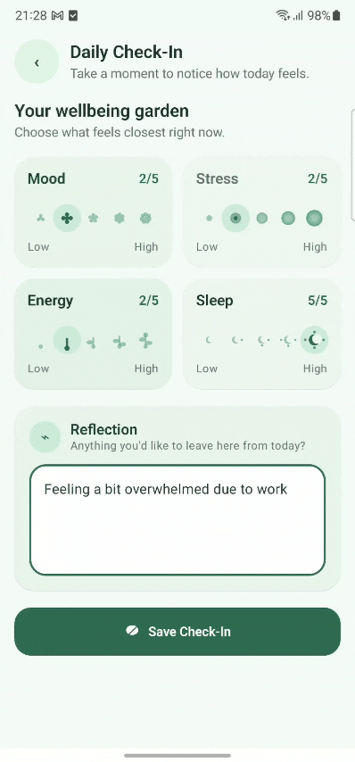
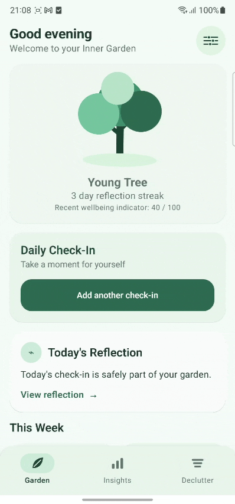
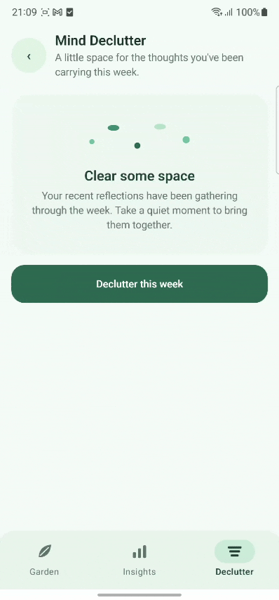
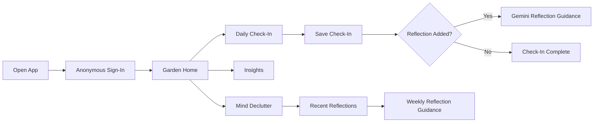
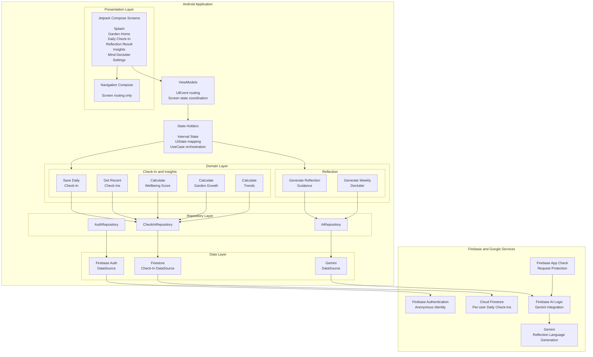
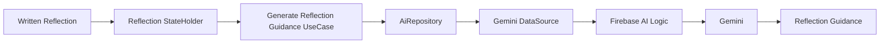
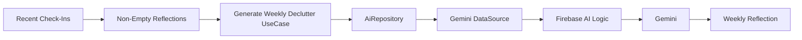

# 🌱 Inner Garden

**A quiet space to check in, reflect, and grow.**

Inner Garden is a calm Android wellbeing app that helps people pause, record a daily check-in, notice recent patterns, and reflect on recurring thoughts. The experience combines private user-generated check-ins, deterministic wellbeing insights, a growing garden metaphor, and carefully bounded AI guidance.

<p align="center">
  
</p>
<p align="center">
  <i>Grow gently, one day at a time.</i>
</p>

---

## 🌿 What Inner Garden offers

- **Daily Check-In** for mood, stress, energy, and sleep
- **Optional Reflection** to capture what is on your mind
- **Growing Garden** that develops through consistent check-ins
- **Wellbeing Insights** calculated deterministically from recent check-ins
- **Reflection Guidance** generated by Gemini with clear non-clinical boundaries
- **Mind Declutter** to gather recurring themes from recent reflections
- **Private Cloud Persistence** through anonymous authentication and Firestore

---

## ✨ Experience Inner Garden

Inner Garden is designed around a small daily rhythm:

<p>
  <strong>Arrive → Check in → Reflect → Grow → Notice → Declutter</strong>
</p>

<table width="100%">
<tr>
<td align="center" width="50%">
<br/>
<strong>🌳 Your Garden</strong>
<br/>
<sub><i>A living home that grows through showing up.</i></sub>
<hr width="30%">

<br/>
<br/>
</td>
<td align="center" width="50%">
<br/>
<strong>🌿 Daily Check-In</strong>
<br/>
<sub><i>Notice mood, stress, energy, sleep, and optionally write.</i></sub>
<hr width="30%">

<br/>
<br/>
</td>
</tr>
</table>

<table width="100%">
<tr>
<td align="center" width="50%">
<br/>
<strong>✨ Guided Reflection</strong>
<br/>
<sub><i>Turn a written thought into gentle, bounded reflection guidance.</i></sub>
<hr width="30%">

<br/>
<br/>
</td>
<td align="center" width="50%">
<br/>
<strong>📊 Weekly Insights</strong>
<br/>
<sub><i>See recent patterns without turning emotions into judgments.</i></sub>
<hr width="30%">

<br/>
<br/>
</td>
</tr>
</table>

<table width="100%">
<tr>
<td align="center" width="100%">
<br/>
<strong>🍃 Mind Declutter</strong>
<br/>
<sub><i>Gather recent reflections, notice recurring themes, and make a little space for the week ahead.</i></sub>
<hr width="15%">

<br/>
<br/>
</td>
</tr>
</table>

---

## 🔄 Product flow



---

## 🏗️ Architecture

Inner Garden follows a strict unidirectional MVVM architecture. Presentation, state management, deterministic business logic, persistence, and AI generation remain separated through explicit boundaries.


---

## 🗃️ Data

The primary data source is **user-generated daily check-ins**.

Each check-in can contain:

- Mood
- Stress
- Energy
- Sleep quality
- Optional written reflection
- Date and timestamp

Check-ins are associated with an anonymous Firebase user and persisted in Cloud Firestore.

```text
Cloud Firestore

users/
└── {uid}/
    └── checkIns/
        └── {yyyy-MM-dd}
            ├── mood
            ├── stress
            ├── energy
            ├── sleepQuality
            ├── reflection
            ├── localDate
            └── timestamp
```

Synthetic check-ins are used only during development and testing. They do not represent real users.

---

### Generated with Gemini

| Reflection experience | Gemini |
|---|:---:|
| Reflection summary | ✓ |
| Personalized affirmation | ✓ |
| Thoughtful reflection question | ✓ |
| Small everyday wellness activity | ✓ |
| Weekly Mind Declutter summary | ✓ |
| Recurring reflection themes | ✓ |
| Carry-forward reflection | ✓ |

> **Gemini helps the user reflect. It does not assess, diagnose, treat, or calculate wellbeing.**

---

## ✨ AI flows

### Daily Reflection

A written reflection follows a dedicated AI path:



The resulting guidance contains a concise summary, affirmation, reflection question, and small everyday wellness activity.

Mood, stress, energy, sleep, garden growth, streaks, and trends remain outside this AI flow.

### Weekly Mind Declutter

Mind Declutter works with recent non-empty written reflections:



The generated experience can surface a weekly summary, recurring themes, something worth carrying forward, and a question to sit with.

---

## 🛠️ Technology

| Area | Technology |
|---|---|
| **Language** | Kotlin |
| **Async** | Kotlin Coroutines |
| **UI** | Jetpack Compose |
| **Design System** | Material 3 |
| **Architecture** | MVVM + StateHolder + Use Cases + Repository |
| **State** | StateFlow |
| **Navigation** | Navigation Compose |
| **Authentication** | Firebase Anonymous Authentication |
| **Database** | Cloud Firestore |
| **AI Integration** | Firebase AI Logic |
| **Generative AI** | Gemini |
| **App Protection** | Firebase App Check |
| **Testing** | JUnit + Compose Testing |

---

## 🔐 Privacy and wellbeing boundaries

Inner Garden is designed for **everyday self-reflection, not clinical assessment**.

Gemini can help summarize what a user chooses to write, offer a supportive affirmation, suggest a thoughtful question, and provide a small, low-risk everyday activity.

It does **not**:

- Diagnose mental health conditions
- Perform psychological or clinical assessments
- Assess clinical risk
- Recommend medication or treatment
- Act as a therapist
- Calculate wellbeing scores
- Determine garden growth
- Infer clinical meaning from mood or behavior

Daily check-ins are stored under the user's anonymous Firebase identity.

---

## ⚙️ Local setup

1. Clone the repository and open it in Android Studio.
2. Use a JDK compatible with the configured Android Gradle Plugin.
3. Add the Firebase Android configuration for `com.innergarden.app` to the app module.
4. Enable Anonymous Authentication and Cloud Firestore for the Firebase project.
5. Configure Firebase AI Logic and Gemini.
6. Configure the appropriate Firebase App Check provider for the build environment.
7. Build and run the `app` configuration on Android 8.0 or newer.

> Firebase configuration files, credentials, App Check debug tokens, signing keys, and other secrets are intentionally excluded from the repository.

---

## 🚀 Project status

The complete core experience is implemented end to end:

<p align="center">
  <strong>Check in → Reflect → Grow → Notice patterns → Declutter the week</strong>
</p>

Inner Garden currently includes anonymous entry, cloud-backed daily check-ins, deterministic garden growth and insights, Gemini-powered reflection guidance, and the weekly Mind Declutter experience.

<p align="center">
  🌱 <strong>Grow gently, one day at a time.</strong>
</p>

---
<sub><i>Inner Garden – Google Patchamomma 2026</i></sub>
