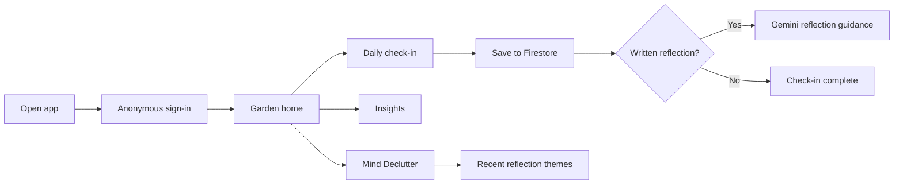
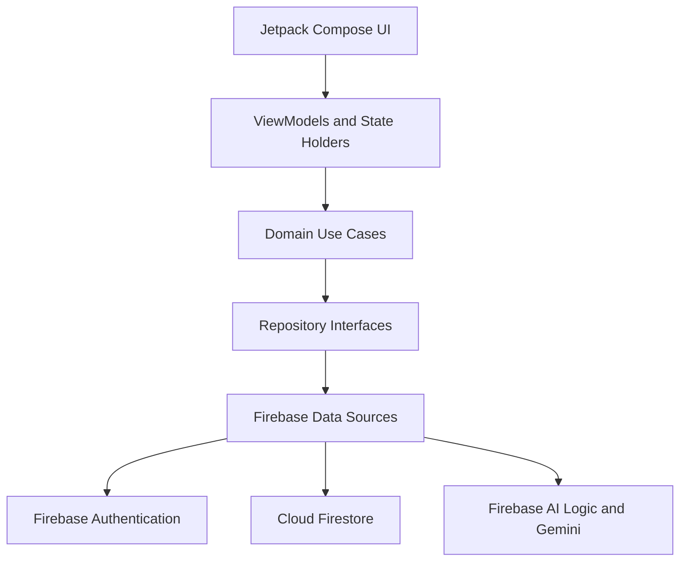

# Inner Garden

Inner Garden is a calm Android wellbeing app that helps people pause, record a daily check-in, notice recent patterns, and reflect on recurring thoughts. The experience combines private user-generated check-ins, deterministic wellbeing insights, a growing garden metaphor, and carefully bounded AI guidance.

## What the app offers

- Daily ratings for mood, stress, energy, and sleep
- An optional written reflection
- A personal garden that grows through consistent check-ins
- A deterministic wellbeing indicator and recent seven-day trends
- Gemini-generated, non-clinical reflection guidance
- Mind Declutter, which gathers recurring themes from recent reflections
- Anonymous sign-in with cloud-backed check-in storage

## Product flow

## Screenshots

> Add a Garden home screenshot here.

> Add a Daily Check-In screenshot here.

> Add a Reflection Result screenshot here.

> Add an Insights screenshot here.

> Add a Mind Declutter screenshot here.

## Architecture

The app follows a strict MVVM structure with clear boundaries between Compose UI, state holders and ViewModels, domain use cases, repositories, and Firebase data sources.

## Data and AI responsibilities

The primary data source is user-generated daily check-ins. Synthetic check-ins exist only as development and test fixtures.

Gemini creates concise, non-clinical guidance from written reflections and summarizes recurring themes for Mind Declutter. Kotlin use cases, not AI, calculate the wellbeing indicator, tree stage, streak, and trends. This keeps measurable product behavior transparent and testable.

## Technology

- Kotlin and Coroutines
- Jetpack Compose and Material 3
- Navigation Compose
- Android ViewModel and StateFlow
- Firebase Anonymous Authentication
- Cloud Firestore
- Firebase AI Logic with Gemini 3.5 Flash Lite
- JUnit and Compose testing tools

## Local setup

1. Open the project in Android Studio.
2. Use a JDK compatible with the configured Android Gradle Plugin.
3. Add the Firebase Android configuration file for `com.innergarden.app` to the app module.
4. Enable Anonymous Authentication, Cloud Firestore, Firebase AI Logic, and the required App Check configuration in the Firebase project.
5. Build and run the `app` configuration on an Android device or emulator running Android 8.0 or newer.

## Privacy and wellbeing boundaries

Inner Garden is designed for everyday self-reflection. AI output is supportive and non-clinical. It does not diagnose conditions, assess risk, prescribe treatment, or calculate wellbeing metrics.

## Project status

The current app supports the complete journey from anonymous entry and daily check-in through cloud persistence, reflection guidance, garden growth, recent insights, and weekly Mind Declutter themes.
